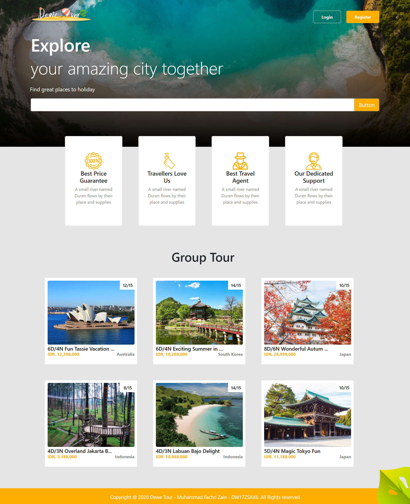

# DEWE TOUR

1. install node_module di masing-masing folder (npm install)
2. cp .env.copy .env (pada folder server) 
3. import .sql dan samain dengan nama database yg ada di server/config
4. di server jalankan nodemon index.js (install package nodemon dulu), lalu di client jalankan npm start, jangan lupa XAMPP di start
5. untuk login admin.. register terlebih dahulu trus ubah didatabase rolenya ke 1

